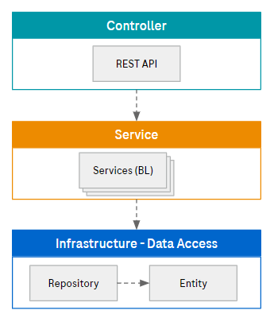
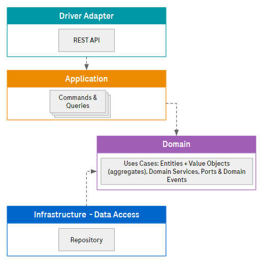
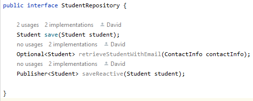
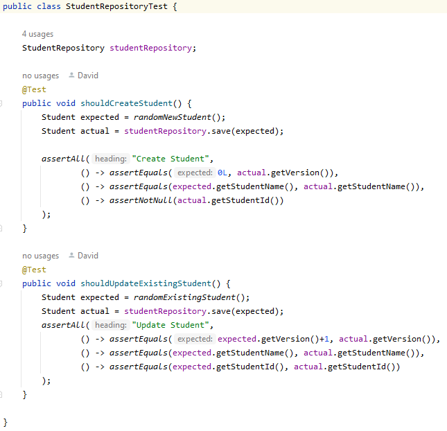
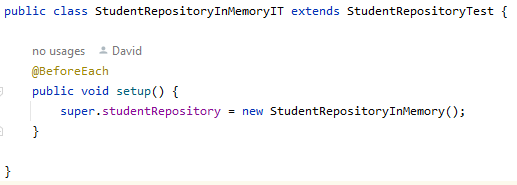
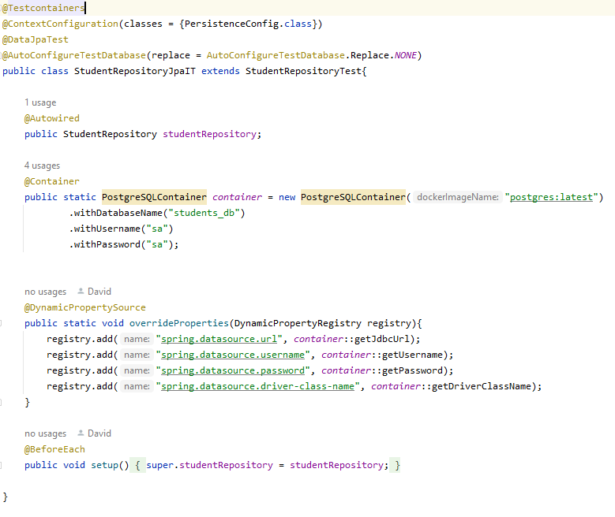
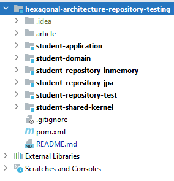

# Clean code repository testing

Many of the software solutions that are usually developed in the enterprise context, have some sort of state that needs to be persited in a durable store for later access. Depending on the specific functional and non-functional requirements, the selection of the right persistence solution can be hard to make, and most likely would require an Architecture Decision Record (ADR) where the rationale of the selection, including alternatives and tradeoffs, are detailed. For persisting your application state, most likely you will look at the CAP Theorem to make the most adequate decision.

This decision process should not delay the design and development of your application's domain model. Engineering teams should focus on delivering (business) value, not on maintaining a bunch of DDL scripts and evolving a highly changing database schema, for some weeks (or months) later realize that it would had been better using a document database instead of a relational database.

Also focusing on delivery domain value prevents the team from taking domain related decision based on the constraints of a too-early-taken technical and/or infrastructure related decision (i.e. the database technology in this case). As Uncle Bob said in this [tweet](https://twitter.com/unclebobmartin/status/118403913937453056?ref_src=twsrc%5Etfw%7Ctwcamp%5Etweetembed%7Ctwterm%5E118403913937453056%7Ctwgr%5Ecfbd06a4d7b4371a13ab18348849e58dbf9b481a%7Ctwcon%5Es1_c10&ref_url=https%3A%2F%2Fpublish.twitter.com%2F%3Fquery%3Dhttps3A2F2Ftwitter.com2Funclebobmartin2Fstatus2F118403913937453056widget%3DTweet), the architecture shall allow deferring the framework decisions (and also infrastructure ones)

## Deferring infrastructure related decisions

Coming back to the database technology example, a way of deferring the infrastructure decision regarding which database technology shall be used, would be starting with a simple in-memory implementation of your repository where the domain entites can be stored in a list in memory. This approach accelerates the discovery, design and implementation of features and domain use cases, enabling fast feedback cycles with your stakeholders about what really matters: **Domain Value**.

Now you might be thinking: *"but then, I'm not delivering an e2e working feature"* or *"But how I verify the feature with an in-memory adapter of my repository"*. Here, architecture patterns like Hexagonal Architecture (also know as ports and adapters) and methodologies like DDD (not mandatory for having a Clean Architecture and ultimately Clean Code) come into action.

## Hexagonal Architecture

Many applications are designed following the classical three layered architecture, with Presentation/Controller, Service (business logic) and Persistence layers. This kind of architecture tend to mix domain definition (e.g. Domain Entites and Value Objects) with tables (e.g. ORM entities) usually represented as simple Data Transfer Objects. This is shown below:

On the contrary, with Hexagonal Architecture the actual persistence related classes are all defined based on the domain model.

By using the port (interface) of the repository (which is defined as part of the domain model) it is possible to define *integration test definitions*  agnostic of the underlying technology, just verifies the domain expectations towards the repository. Next image shows an example of such a port:

## Show me the code

Based on the repository port specification, it is possible to crate the *integration test definition* which is only dependent on the port, and therefore agnostic of any underlying technology decision made for persisting the domain state. This test class will have as a property an instance of the repository interface (port) over which the expectations are verified. Next image shows how these tests look like:

Once the repository test definition is completed, we can create a test runtime (integration test) for the in-memory repository:

Or a bit more elaborated integration test for JPA with postgres.

Both *test runtime* are extending the very same test definition, therefore we can be sure that when switching from the in-memory adapter to the final, JPA-full-featured persistence, no test shall be affected, being only needed to configure the corresponding test runtime.

This approach will allow to define the tests of the repository port without any dependency on frameworks, and reuse those tests once the domain is better defined, being more stable, and the team decides to move forward with the database technology the better fulfill the solution quality attributes.

The overall structure of the project is shown in the next image:

Where:

* **student-domain:** Module with the domain definition, including entities, value objects, domain events, ports, etc. This module has no dependencies with frameworks, being as pure Java as possible.
* **student-application:** Currently this module has no code since was out-of-scope of the article. Following hexagonal architecture, this module orchestrates invocations to the domain model, being the entry point of the domain use cases. Future articles will enter in more details.
* **student-repository-test:** This module contains the repository test definitions, with no dependencies to frameworks, only verifies the expectation of the provided repository port.
* **student-repository-inmemory:** In-memory implementation of the repository port defined by the domain. It also contains the integration test which provides the in-memory adapter of the port to the test definition of `student-repository-test`.
* **student-repository-jpa:** JPA implementation of the repository port defined by the domain. It also contains the integration test which provides the in-memory adapter of the port to the test definition of `student-repository-test`. This integration test setup is a bit more complex since it spin-up a basic Spring context together with a Postgres container. 
* **student-shared-kernel:** This module is out-of-scope of the article, just provide some utility classes and interfaces for designing the rest of the project.

As a summary, using this architectural style for your projects promotes good separation between domain model and infrastructure elements around it, ensuring that the latter will not influence the former, while promoting good code quality (clean code) and high maintainability.

All the code of this article can be found in my personal [Github repository](https://github.com/dcano/hexagonal-architecture-repository-testing).